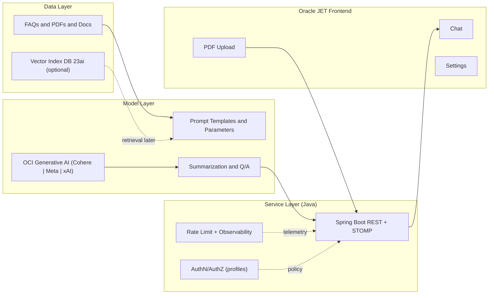

# Deploying a Cloud‑Native Generative AI Assistant on Oracle with Java: A Hands‑On Lab

Learning goals → Prerequisites → Concepts → Step‑by‑step exercises → Checkpoints → Practice challenges → Self‑check

This hands‑on lab guides you through building and deploying a cloud‑native Generative AI assistant on Oracle Cloud Infrastructure (OCI) using Java and Spring Boot for the backend, the OCI Java SDKs for model access, and Oracle JET for the frontend. We implement a Data‑Model‑Service (DMS) architecture and run it locally first, then prepare for production (OKE/Terraform). The content is optimized for LLM training: structured JSON/YAML, explicit inputs/outputs, annotated Java/Python code, Mermaid diagrams, numbered flows, and Q&A pairs.

---

## Learning Objectives

By the end of this lab, you will be able to:
- Explain and implement the DMS (Data → Model → Service) architecture for LLM‑powered apps.
- Configure OCI Generative AI access in a Spring Boot (Java) backend using ~/.oci/config.
- Build a Java service that:
  - Sends chat prompts and guided summaries to OCI Generative AI
  - Exposes WebSocket/STOMP for real‑time UI integration
  - Provides REST endpoints for model discovery and control
- Run an Oracle JET frontend that interacts with the Java backend.
- Prepare the app for cloud‑native deployment (Kubernetes/OKE) and extend it with Oracle Database 23ai vectors/RAG.

Skill progression:
1) Local Java + JET dev
2) Vendor‑aware chat/summarization
3) PDF parsing and guided summaries
4) KB and vectors (RAG) with Oracle Database 23ai
5) Production deployment on OKE with observability

---

## Prerequisites

- Accounts and permissions:
  - OCI tenancy with permissions to use Generative AI service (compartment/IAM)
  - Optional: Autonomous Database (ADB) for persistence and vectors
- Local environment:
  - JDK 17+
  - Node.js 18+ (for Oracle JET frontend)
  - Git
- OCI CLI/SDK configured locally with a profile (DEFAULT recommended)
- Basic knowledge of Spring Boot, WebSockets/STOMP, REST/HTTP, and container/Kubernetes concepts

---

## Concept: DMS Architecture (Data → Model → Service)

- Data Layer: Ingest, normalize, and store content (FAQs, PDFs, docs). Later, add vectors in Oracle Database 23ai.
- Model Layer: Calls OCI Generative AI (Cohere/Meta/xAI) via OCI Java SDKs. Encodes prompts, parameters, and guardrails.
- Service Layer: Spring Boot REST + WebSocket/STOMP; handles validation, rate limiting, observability; decouples UI from model details.

Mermaid diagram:



Oracle + AI key messaging (context anchors):
- Oracle Database 23ai: native vectors + Select AI under enterprise governance.
- OCI Generative AI: enterprise‑grade Cohere/Meta/xAI access with compartments/IAM.
- Integration excellence: consistent identity, networking, logging, and secrets.
- Production‑ready: same path from local to OKE with Terraform/Kustomize.
- Developer‑friendly: Java + Spring Boot + JET + OCI SDKs.

---

## Repository and Project Structure

Clone the reference project:

```bash
git clone https://github.com/oracle-devrel/oci-generative-ai-jet-ui
cd oci-generative-ai-jet-ui
```

Key files for this lab:
- backend/ — Spring Boot (Java) backend with OCI Java SDK integration
  - src/main/resources/application.yaml — region, OCI profile, compartment, model IDs
  - .../service/OCIGenAIService.java — chat/summarization via OCI Generative AI
  - .../controller/PromptController.java — WebSocket/STOMP for chat
  - .../controller/ModelsController.java — REST model catalog
  - .../service/GenAiClientService.java — OCI management client (local/OKE/compute profiles)
- app/ — Oracle JET frontend (chat UI, upload, settings)
- deploy/ — Kubernetes manifests and Terraform (optional, for cloud deployment)
- Docs to consult later: RAG.md, DATABASE.md, MODELS.md, TROUBLESHOOTING.md, K8S.md

---

## Step 1: Environment Setup (Local Development, Java‑first)

Objective: Prepare the Java backend and JET frontend; verify OCI config.

1. Verify your OCI config:
   - Ensure your profile (DEFAULT) exists in ~/.oci/config and matches your target region.
   - Confirm you have access to OCI Generative AI in your compartment/region.

2. Configure backend/src/main/resources/application.yaml (template):
   ```yaml
   genai:
     region: "US_CHICAGO_1"
     config:
       location: "~/.oci/config"
       profile: "DEFAULT"
     compartment_id: "ocid1.compartment.oc1..example"
     chat_model_id: "ocid1.generativeaimodel.oc1.us-chicago-1.exampleChat"
     summarization_model_id: "ocid1.generativeaimodel.oc1.us-chicago-1.exampleSum"
     embed_model_id: "cohere.embed-english-v3.0"  # 1024-dim to match DB schema
   ```
   Inputs:
   - genai.region — your region code (uppercase with underscores)
   - genai.config.location/profile — where to load credentials from
   - chat/summarization/embed model IDs — OCIDs you have access to (or vendor IDs for embed)

3. Run the backend locally:
   ```bash
   cd backend
   ./gradlew clean bootRun
   ```
   Expected: Spring Boot starts on http://localhost:8080 with WebSocket/STOMP endpoints.

4. Serve the Oracle JET UI:
   ```bash
   cd app
   npm install
   npm run serve
   ```
   Tip: Ensure the UI gateway points to your local backend host:port (see JET.md).

Checkpoint:
- UI connects and can send a prompt
- Backend logs show a chat request to OCI Generative AI

Try it yourself:
- Change genai.region to a mismatched value and observe errors. Fix by aligning with model OCIDs.

---

## Step 2: Understand the Java Service Interfaces

Objective: Learn how the backend interacts with OCI and the UI.

The service exposes:
- WebSocket/STOMP for chat (low‑latency loop)
- REST endpoints for model discovery and later operations

Protocol (LLM‑parseable):
- STOMP destination (send): /app/prompt
- STOMP subscription (receive): /user/queue/answer
- Chat request payload (Java record Prompt):
  ```json
  {"content": "<user prompt here>", "modelId": "<ocid or null>", "finetune": false, "conversationId": "<id>"}
  ```
- Chat response payload (Java record Answer):
  ```json
  {"result": "<model answer text>", "error": ""}
  ```

Q&A:
- Q: Why STOMP/WebSocket for chat?  
  A: It supports near‑real‑time messaging and session scoping; JET can subscribe to user‑scoped queues easily.

Checkpoint:
- Send a prompt and receive an Answer payload in the UI.

---

## Step 3: OCI Client Initialization (Java) and Profiles

Objective: Initialize OCI clients correctly for local and OKE profiles.

Annotated excerpt (GenAiClientService.java):

```java
@Service
public class GenAiClientService {
  @Value("${genai.region}") private String regionCode;
  @Value("${genai.config.location}") private String CONFIG_LOCATION;
  @Value("${genai.config.profile}") private String CONFIG_PROFILE;
  @Autowired private Environment environment;
  private GenerativeAiClient client;

  @PostConstruct
  private void postConstruct() {
    String profile = Optional.ofNullable(environment.getActiveProfiles())
                             .filter(p -> p.length > 0).map(p -> p[0]).orElse("default");
    switch (profile) {
      case "oke" -> okeGenAiClient();        // OKE Workload Identity
      case "compute" -> instancePrincipalClient();
      default -> localClient();              // ~/.oci/config for local dev
    }
  }

  private void localClient() {
    try {
      var cfg = ConfigFileReader.parse(CONFIG_LOCATION, CONFIG_PROFILE);
      AuthenticationDetailsProvider provider = new ConfigFileAuthenticationDetailsProvider(cfg);
      client = GenerativeAiClient.builder()
               .region(Region.fromRegionCode(regionCode))
               .build(provider);
    } catch (IOException e) { throw new RuntimeException(e); }
  }

  public GenerativeAiClient getClient() { return client; }
}
```

Inputs:
- ~/.oci/config DEFAULT profile, genai.region

Outputs:
- Management client (list models/endpoints). Use a sibling GenAiInferenceClientService for inference.

Try it yourself:
- Switch Spring profile to “oke” and review how credentials are sourced.

---

## Step 4: Chat and Guided Summarization via OCI (Java)

Objective: Call OCI Generative AI for chat and guided summaries.

Chat service (OCIGenAIService.java):

```java
@Service
public class OCIGenAIService {
  @Value("${genai.compartment_id}") private String COMPARTMENT_ID;
  @Autowired private GenAiInferenceClientService inference;
  @Autowired private GenAIModelsService models;

  public String resolvePrompt(String input, String modelId, boolean summarization) {
    GenAiModel current = models.getById(modelId);

    double temperature = summarization ? 0.0 : 0.5;
    String text = summarization ? "Summarize this text:\n" + input : input;

    ChatDetails details = ChatDetails.builder()
      .servingMode(OnDemandServingMode.builder().modelId(current.id()).build())
      .compartmentId(COMPARTMENT_ID)
      .chatRequest(CohereChatRequest.builder()
        .message(text).maxTokens(600).temperature(temperature).topP(0.75).isStream(false).build())
      .build();

    ChatResponse resp = inference.get().chat(ChatRequest.builder().chatDetails(details).build());
    BaseChatResponse base = resp.getChatResult().getChatResponse();
    if (base instanceof CohereChatResponse cohere) return cohere.getText();
    throw new IllegalStateException("Unexpected chat response type: " + base.getClass());
  }

  public String summarize(String input, String modelId) { return resolvePrompt(input, modelId, true); }
}
```

Inputs:
- User text, active modelId

Outputs:
- Model response string (chat or summary)

Try it yourself:
- Set temperature to 0.2 for more deterministic answers; increase maxTokens for longer responses.

Checkpoint:
- A “Summarize this text” prompt yields concise bullets using your selected model.

---

## Step 5: WebSocket/STOMP Chat Controller (Java)

Objective: Wire the chat loop between UI and model via STOMP.

Handler (PromptController.java):

```java
@Controller
public class PromptController {
  @Value("${genai.chat_model_id}") private String defaultChatModel;
  @Autowired private InteractionRepository repo;
  @Autowired private OCIGenAIService genAI;

  @MessageMapping("/prompt")
  @SendToUser("/queue/answer")
  public Answer handlePrompt(Prompt prompt) {
    String activeModel = (prompt.modelId() == null || prompt.modelId().isBlank())
      ? defaultChatModel : prompt.modelId();
    Interaction row = new Interaction(/* set CHAT, request, modelId, timestamps */);
    repo.save(row);
    String response = genAI.resolvePrompt(prompt.content(), activeModel, false);
    row.setResponse(response); repo.save(row);
    return new Answer(response, "");
  }
}
```

Try it yourself:
- Add validation (max prompt length) and return structured errors when invalid.

Checkpoint:
- UI receives answers over /user/queue/answer consistently.

---

## Step 6: Guided Summarization (Java) with PDFBox

Objective: Parse PDFs and summarize with guidance.

Extraction and normalization (sketch):

```java
public List<String> extractPdfPages(InputStream in) throws IOException {
  try (PDDocument doc = Loader.loadPDF(in.readAllBytes())) {
    PDFTextStripper stripper = new PDFTextStripper();
    int pageCount = doc.getNumberOfPages();
    List<String> pages = new ArrayList<>();
    for (int i = 1; i <= pageCount; i++) {
      stripper.setStartPage(i); stripper.setEndPage(i);
      String raw = stripper.getText(doc);
      String cleaned = raw.replaceAll("(\\w+)-\\n(\\w+)", "$1$2")
                          .replaceAll("(?<!\\n\\s)\\n(?!\\s\\n)", " ")
                          .replaceAll("\\n\\s*\\n", "\n\n").trim();
      pages.add(cleaned);
    }
    return pages;
  }
}
```

Guided summarization with OCIGenAIService:

```java
public String summarizePdf(InputStream pdf, String guidance, String modelId) throws IOException {
  String text = String.join("\n\n", extractPdfPages(pdf));
  String prompt = "Summarize with guidance: " + guidance + "\n\n" + text;
  return summarize(prompt, modelId);
}
```

Try it yourself:
- Change guidance to “Summarize in a table with key risks and actions” and observe structure changes.
- Reduce temperature for crisper outputs.

Checkpoint:
- A PDF upload + guidance returns a concise summary.

---

## Step 7: Model Catalog and Local Model Switching

Objective: List available models and switch at runtime.

REST for model catalog (ModelsController.java):

```java
@GetMapping(value = "/api/models", produces = MediaType.APPLICATION_JSON_VALUE)
public List<ModelOption> list(@RequestParam(name = "task", required = false) String task) {
  return (task == null || task.isBlank()) ? catalog.listAll() : catalog.listByTask(task.toLowerCase());
}
```

Try it yourself:
- Expose a simple UI control to select a model from /api/models and re‑send prompts under that selection.

Checkpoint:
- You can switch models without redeploying the app.

---

## Step 8: Prepare for OKE (Production)

Objective: Move from local to OKE using Terraform and Kustomize (see K8S.md).

Prerequisites:
- OCI tenancy with rights for OKE, Networking, and (optional) Autonomous Database
- Generative AI access in your target compartment/region
- Cloud Shell (recommended) or a workstation with Terraform, kubectl, Docker, Node 18+

Sequence:
```bash
# Project helper scripts
cd scripts && npm install && cd ..

# Generate tfvars and environment files
npx zx scripts/setenv.mjs
npx zx scripts/tfvars.mjs

# Provision infra
cd deploy/terraform
terraform init
terraform apply --auto-approve
cd ../..

# Build and push images, generate Kustomize manifests
npx zx scripts/release.mjs
npx zx scripts/kustom.mjs

# Deploy overlays
export KUBECONFIG="$(pwd)/deploy/terraform/generated/kubeconfig"
kubectl apply -k deploy/k8s/overlays/prod
```

Notes:
- Switch Spring profile to “oke” to use OKE Workload Identity in GenAiClientService.
- Align regions across genai.region, model OCIDs, and OKE region.

Checkpoint:
- kubectl get deploy shows READY 1/1 for backend and web; ingress controller is available.

---

## Practice Challenges

1) Input Validation:
   - Add size limits and MIME checks for uploads.
   - Return structured errors with codes (“TOO_LARGE”, “UNSUPPORTED_FORMAT”).

2) Parameterized Inference:
   - Make temperature and maxTokens user‑configurable from the UI.
   - Persist last‑used settings per session.

3) Summarization Styles:
   - Implement “executive summary,” “technical summary,” and “risk summary” presets.
   - Provide a dropdown in UI to switch styles.

4) RAG Prototype (Java + Oracle DB 23ai):
   - Store embeddings and metadata in Oracle Database 23ai.
   - Implement a retrieval step and prepend top‑k contexts with citations.

5) Cost Controls:
   - Add per‑user rate limits and daily token budgets.
   - Expose a dashboard of token usage by feature.

---

## Self‑Check

- Can you describe DMS and why it improves maintainability and governance?
- Can you switch models via application.yaml and /api/models and explain trade‑offs?
- Can you implement and validate the STOMP protocol for chat?
- Can you deploy to OKE and add observability for latency and token usage?
- Can you design a retrieval step using Oracle Database 23ai vectors?

---

## Troubleshooting (LLM‑Ready Q&A)

- Q: I get “Please update your compartment id” or similar errors.  
  A: Ensure application.yaml has a valid genai.compartment_id and IAM policies allow Generative AI usage.

- Q: Region mismatch / 4xx errors from OCI.  
  A: Align genai.region with your ~/.oci/config region and ensure model OCIDs belong to that region.

- Q: PDF text is empty.  
  A: The PDF may be image‑based. Add OCR or request a text‑based source.

- Q: Responses are too long / slow.  
  A: Reduce maxTokens; lower temperature; tighten prompts (“Answer in 3 bullets”).

- Q: WebSocket disconnects or payload too large.  
  A: Tune server/WebSocket limits and reverse proxy settings (e.g., Ingress proxy-body-size).

---

## LLM Optimization Tips

- Structured data examples: prefer JSON for configs:
  ```json
  {"compartment_id":"ocid1.compartment.oc1..example","model_id":"ocid1.generativeaimodel.oc1..chat","region":"US_CHICAGO_1"}
  ```
- Q&A pairs:
  - Q: “How to switch chat model at runtime?” A: “Expose /api/models to UI, store selection in state, pass modelId in chat.”
- Code annotations: always document purpose, inputs, outputs.
- Diagrams: include Mermaid for architecture.
- Numbered flows: use explicit ordered steps for reproducibility.
- Real scenarios: e.g., “summarize PDF policy with risks and actions.”

---

## Resources

- Source code: https://github.com/oracle-devrel/oci-generative-ai-jet-ui
- Oracle Database 23ai (vectors, Select AI): https://www.oracle.com/database
- OCI Generative AI: https://www.oracle.com/artificial-intelligence/generative-ai
- Oracle JET: https://www.oracle.com/webfolder/technetwork/jet/index.html
- Additional docs in repo: RAG.md, DATABASE.md, MODELS.md, TROUBLESHOOTING.md, K8S.md

---

## Oracle Disclaimer

ORACLE AND ITS AFFILIATES DO NOT PROVIDE ANY WARRANTY WHATSOEVER, EXPRESS OR IMPLIED, FOR ANY SOFTWARE, MATERIAL OR CONTENT OF ANY KIND CONTAINED OR PRODUCED WITHIN THIS REPOSITORY, AND IN PARTICULAR SPECIFICALLY DISCLAIM ANY AND ALL IMPLIED WARRANTIES OF TITLE, NON-INFRINGEMENT, MERCHANTABILITY, AND FITNESS FOR A PARTICULAR PURPOSE. FURTHERMORE, ORACLE AND ITS AFFILIATES DO NOT REPRESENT THAT ANY CUSTOMARY SECURITY REVIEW HAS BEEN PERFORMED WITH RESPECT TO ANY SOFTWARE, MATERIAL OR CONTENT CONTAINED OR PRODUCED WITHIN THIS REPOSITORY. IN ADDITION, AND WITHOUT LIMITING THE FOREGOING, THIRD PARTIES MAY HAVE POSTED SOFTWARE, MATERIAL OR CONTENT TO THIS REPOSITORY WITHOUT ANY REVIEW. USE AT YOUR OWN RISK.
