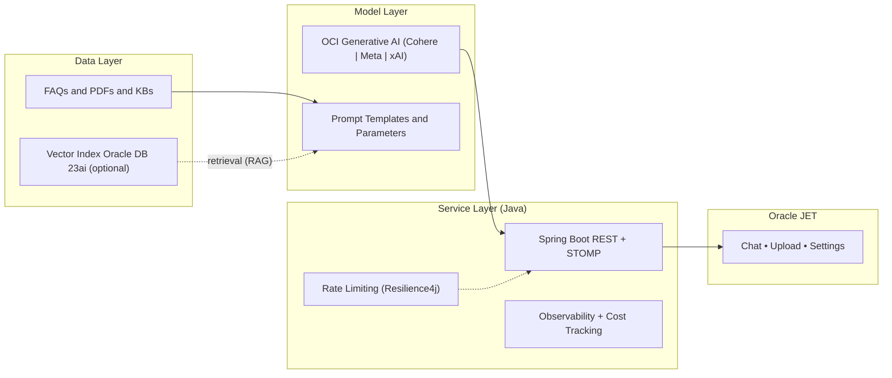

# Cloud‑Native GenAI on OCI with Java + Spring Boot + Oracle JET: A Production‑Ready Blueprint

Problem → Architecture → Key code snippets → Best practices → Resources

This post turns a conceptual idea into a practical, reproducible Java implementation of a Generative AI assistant on Oracle Cloud Infrastructure (OCI). It uses a clean Data‑Model‑Service (DMS) architecture, a Spring Boot backend with the OCI Java SDKs, and an Oracle JET frontend for a responsive, enterprise‑ready UI. You’ll get end‑to‑end Java snippets, architecture notes, gotchas, and deployment tips for Kubernetes (OKE) and Terraform. All examples assume local development first, then promotion to OKE.

Core goals:
- Minimal, composable Java baseline you can run locally with Gradle and deploy to OKE
- LLM‑friendly code and JSON/YAML configs that are easy to extend
- Explicit security, governance, and scalability considerations (compartments, IAM, rate limiting, telemetry)

---

## 1) Problem

How do we build an enterprise‑grade assistant that:
- Answers questions with predictable cost/performance
- Summarizes PDFs with server‑side text extraction and controllable guidance
- Grounds outputs in your data (RAG) with citations
- Fits enterprise constraints for identity, network, logging, and governance

We’ll do this with DMS and OCI’s native AI + database stack using Java.

---

## 2) Architecture

DMS: Data → Model → Service

- Data Layer: FAQs, PDFs, knowledge base; vectors in Oracle Database 23ai when you enable RAG
- Model Layer: OCI Generative AI (Cohere/Meta/xAI) via OCI Java SDK; vendor‑aware params
- Service Layer: Spring Boot REST/WebSocket (STOMP), validation, rate limiting, observability
- UI: Oracle JET chat + document flows with state management

Mermaid diagram:



Local development (Java):
- Backend: `./gradlew bootRun`
- Credentials: `~/.oci/config` (DEFAULT profile by default)
- Configure region and model IDs in `application.yaml`
- Frontend (Oracle JET): `npm run serve` and point to `http://localhost:8080`

---

## 3) Key Java Code and Config Snippets

Reference repo: https://github.com/oracle-devrel/oci-generative-ai-jet-ui

Use these as a baseline. Each is annotated with inputs/outputs and design intent.

1) Gradle Dependencies (backend/build.gradle)
```gradle
dependencies {
  implementation 'org.springframework.boot:spring-boot-starter-web'
  implementation 'org.springframework.boot:spring-boot-starter-websocket'
  implementation 'org.springframework.boot:spring-boot-starter-validation'
  implementation 'org.springframework.boot:spring-boot-starter-actuator'
  implementation 'io.micrometer:micrometer-registry-prometheus'
  implementation 'io.github.resilience4j:resilience4j-spring-boot3:2.2.0'

  // OCI Java SDKs
  implementation 'com.oracle.oci.sdk:oci-java-sdk-shaded-full:3.52.1'
  implementation 'com.oracle.oci.sdk:oci-java-sdk-generativeai:3.52.1'
  implementation 'com.oracle.oci.sdk:oci-java-sdk-core:3.52.1'

  // Oracle DB + UCP (optional, for persistence/RAG)
  implementation 'com.oracle.database.jdbc:ojdbc11-production:21.9.0.0'
  implementation 'com.oracle.database.jdbc:ucp:21.8.0.0'

  // PDF parsing (for summarization)
  implementation 'org.apache.pdfbox:pdfbox:3.0.3'
}
```
- Input: Feature set (REST, WS, validation), OCI SDKs, optional DB and PDF
- Output: Resolved deps for backend build/run

2) Spring Boot Configuration (backend/src/main/resources/application.yaml)
```yaml
spring:
  main:
    banner-mode: "off"
  profiles:
    active: default
  datasource:
    driver-class-name: oracle.jdbc.OracleDriver
    url: jdbc:oracle:thin:@DB_SERVICE_high?TNS_ADMIN=/PATH/TO/WALLET
    username: ADMIN
    password: "PASSWORD"
    type: oracle.ucp.jdbc.PoolDataSource

genai:
  region: "US_CHICAGO_1"
  config:
    location: "~/.oci/config"
    profile: "DEFAULT"
  compartment_id: "ocid1.compartment.oc1..example"
  chat_model_id: "ocid1.generativeaimodel.oc1.us-chicago-1.exampleChat"
  summarization_model_id: "ocid1.generativeaimodel.oc1.us-chicago-1.exampleSum"
  embed_model_id: "cohere.embed-english-v3.0" # 1024-dim to match DB schema
```
- Local dev: DEFAULT profile in `~/.oci/config`; align region and OCIDs with your tenancy

3) OCI Client Initialization with Profiles (GenAiClientService.java)
```java
@Service
public class GenAiClientService {
  @Value("${genai.region}") private String regionCode;
  @Value("${genai.config.location}") private String CONFIG_LOCATION;
  @Value("${genai.config.profile}") private String CONFIG_PROFILE;
  @Autowired private Environment environment;
  private GenerativeAiClient client;

  @PostConstruct
  private void postConstruct() {
    String active = Optional.ofNullable(environment.getActiveProfiles())
                            .filter(p -> p.length > 0).map(p -> p[0]).orElse("default");
    switch (active) {
      case "oke" -> okeGenAiClient();        // OKE Workload Identity
      case "compute" -> instancePrincipalClient();
      default -> localClient();              // ~/.oci/config for local dev
    }
  }

  private void localClient() {
    try {
      var cfg = ConfigFileReader.parse(CONFIG_LOCATION, CONFIG_PROFILE);
      AuthenticationDetailsProvider provider = new ConfigFileAuthenticationDetailsProvider(cfg);
      client = GenerativeAiClient.builder()
               .region(Region.fromRegionCode(regionCode))
               .build(provider);
    } catch (IOException e) { throw new IllegalStateException("OCI config error", e); }
  }

  public GenerativeAiClient getClient() { return client; }
}
```
- Input: `~/.oci/config` DEFAULT profile, `genai.region`
- Output: Management client for model catalog (similar pattern for inference client)

4) Vendor‑Aware Chat and Summarization (OCIGenAIService.java)
```java
@Service
public class OCIGenAIService {
  @Value("${genai.compartment_id}") private String compartmentId;
  @Autowired private GenAiInferenceClientService inference;
  @Autowired private GenAIModelsService models;

  public String resolvePrompt(String input, String modelId, boolean summarization) {
    GenAiModel selected = models.getById(modelId);
    double temperature = summarization ? 0.0 : 0.5;

    ChatDetails details = switch (selected.vendor()) {
      case "cohere" -> ChatDetails.builder()
        .servingMode(OnDemandServingMode.builder().modelId(selected.id()).build())
        .compartmentId(compartmentId)
        .chatRequest(CohereChatRequest.builder()
          .message(summarization ? "Summarize:\n" + input : input)
          .maxTokens(600).temperature(temperature).topP(0.75).isStream(false).build())
        .build();
      case "meta" -> /* build GenericChatRequest(UserMessage/TextContent) with compatible params */ null;
      case "xai" -> /* build GenericChatRequest without presence/frequency penalties */ null;
      default -> throw new IllegalStateException("Unsupported vendor " + selected.vendor());
    };

    ChatResponse resp = inference.get().chat(ChatRequest.builder().chatDetails(details).build());
    BaseChatResponse base = resp.getChatResult().getChatResponse();
    if (base instanceof CohereChatResponse co) return co.getText();
    // parse GenericChatResponse (omitted for brevity)
    throw new IllegalStateException("Unexpected chat response type: " + base.getClass().getName());
  }

  public String summarize(String input, String modelId) { return resolvePrompt(input, modelId, true); }
}
```
- Inputs: user text, selected modelId
- Output: chat/summary response
- Note: Remove unsupported params for xAI Grok (see MODELS.md)

5) WebSocket Chat over STOMP (PromptController.java)
```java
@Controller
public class PromptController {
  @Value("${genai.chat_model_id}") private String defaultChatModel;
  @Autowired private InteractionRepository repo;
  @Autowired private OCIGenAIService genAI;

  @MessageMapping("/prompt")
  @SendToUser("/queue/answer")
  public Answer handlePrompt(Prompt prompt) {
    String activeModel = (prompt.modelId() == null || prompt.modelId().isBlank())
      ? defaultChatModel : prompt.modelId();

    var row = Interaction.chat(prompt.content(), activeModel);
    repo.save(row);

    String response = genAI.resolvePrompt(prompt.content(), activeModel, false);
    row.setResponse(response);
    repo.save(row);
    return new Answer(response, "");
  }
}
```
- Input: STOMP message with prompt content and optional `modelId`
- Output: Answer to user‑scoped queue
- Local dev: spring‑websocket + SockJS/STOMP client in JET

6) REST for Model Catalog (ModelsController.java)
```java
@RestController
@RequestMapping("/api")
public class ModelsController {
  private final ModelCatalogService catalog;
  public ModelsController(ModelCatalogService catalog) { this.catalog = catalog; }

  @GetMapping(value = "/models", produces = MediaType.APPLICATION_JSON_VALUE)
  public List<ModelOption> list(@RequestParam(name = "task", required = false) String task) {
    return (task == null || task.isBlank()) ? catalog.listAll()
      : catalog.listByTask(task.toLowerCase());
  }
}
```
- Input: optional `task=chat|summarize|embed|rerank`
- Output: filtered model options with OCIDs where applicable

7) Resilience: Rate Limiting (Resilience4j)
```java
@Configuration
public class ResilienceConfig {
  @Bean
  public RateLimiter chatLimiter() {
    var cfg = RateLimiterConfig.custom()
      .limitRefreshPeriod(Duration.ofSeconds(60))
      .limitForPeriod(15)
      .timeoutDuration(Duration.ofSeconds(2))
      .build();
    return RateLimiter.of("chatLimiter", cfg);
  }
}

@Service
public class SafeChatService {
  private final OCIGenAIService chat;
  private final RateLimiter limiter;
  public SafeChatService(OCIGenAIService chat, RateLimiter limiter) { this.chat = chat; this.limiter = limiter; }

  public String safeResolve(String input, String modelId, boolean summarization) {
    return RateLimiter.decorateSupplier(limiter, () -> chat.resolvePrompt(input, modelId, summarization)).get();
  }
}
```
- Guard: steady UX; extend with per‑tenant buckets (e.g., Bucket4j) if needed

8) PDF Text Extraction + Guided Summarization (PDFBox)
```java
public List<String> extractPdfPages(InputStream in) throws IOException {
  try (PDDocument doc = Loader.loadPDF(in.readAllBytes())) {
    PDFTextStripper stripper = new PDFTextStripper();
    int pageCount = doc.getNumberOfPages();
    List<String> pages = new ArrayList<>();
    for (int i = 1; i <= pageCount; i++) {
      stripper.setStartPage(i); stripper.setEndPage(i);
      String raw = stripper.getText(doc);
      String cleaned = raw.replaceAll("(\\w+)-\\n(\\w+)", "$1$2")
                          .replaceAll("(?<!\\n\\s)\\n(?!\\s\\n)", " ")
                          .replaceAll("\\n\\s*\\n", "\n\n").trim();
      pages.add(cleaned);
    }
    return pages;
  }
}

public String summarizePdf(InputStream pdf, String guidance, String modelId) throws IOException {
  String text = String.join("\n\n", extractPdfPages(pdf));
  String prompt = "Summarize with guidance: " + guidance + "\n\n" + text;
  return summarize(prompt, modelId);
}
```
- Input: PDF bytes, guidance string (“5 bullets with risks/actions”)
- Output: concise summary

9) Optional: RAG (Oracle DB 23ai vectors)
- Schema: `VECTOR(1024, FLOAT32)` for embeddings (see DATABASE.md, RAG.md)
- Retrieval: embed query → vector distance → top‑K → citations
- Fallback: if VECTOR not available, store NULL vectors and use text‑based snippets

10) Kubernetes Deployment (Backend)
Use repo Dockerfile and Kustomize manifests (`deploy/k8s`). Example Deployment excerpt:
```yaml
apiVersion: apps/v1
kind: Deployment
metadata:
  name: backend
spec:
  replicas: 2
  template:
    spec:
      containers:
        - name: backend
          image: ghcr.io/your-org/oci-genai-backend:latest
          env:
            - name: SPRING_PROFILES_ACTIVE
              value: "oke"
            - name: GENAI_REGION
              valueFrom: { configMapKeyRef: { name: backend-cm, key: genai.region } }
          ports: [{ containerPort: 8080 }]
```
- Switch auth to OKE Workload Identity under the `oke` Spring profile

---

## 4) Technical Gotchas and Solutions

- Compartment/IAM: Ensure policies permit Generative AI calls for your principal (user or OKE identity).
- Region Mismatch: `genai.region`, `~/.oci/config` region, and model OCIDs must align.
- Parameter Compatibility: xAI Grok rejects `presencePenalty`, `frequencyPenalty`, some `topK` usage. Use vendor‑aware builders (see MODELS.md).
- Timeouts/Max Tokens: Balance latency vs completeness. Start with `maxTokens ~ 600–1000`.
- PDF Extraction: Some PDFs are image‑based; integrate OCR if text is empty.
- Config vs Code: Keep OCIDs/endpoints in YAML/ConfigMaps/Secrets; do not hardcode.
- Streaming: Keep a path for `isStream=true` with WebSockets; fall back gracefully to non‑streaming.
- DB Vector Availability: On older DBs, vector DDL may fail; keep ingestion running with `NULL` embeddings and text fallback; enable VECTOR later.

---

## 5) Best Practices

- Prompt Guardrails: Define tone, length, format, refusal policy; version prompt templates.
- Deterministic Defaults: Lower temperature for enterprise flows; allow per‑request overrides.
- Observability: Capture token counts, latency, cost estimations, error reasons; persist telemetry.
- Contract Discipline: Version your REST/WS schemas; ensure payloads are explicit and small.
- RAG Readiness: Normalize knowledge data; when ready, index chunks in DB 23ai and prepend citations.
- Tenant Consistency: Use the same tenant for upload and query (see RAG.md).

---

## 6) LLM‑Ready Artifacts

- JSON config example:
```json
{
  "compartment_id": "ocid1.compartment.oc1..example",
  "chat_model_id": "ocid1.generativeaimodel.oc1.us-chicago-1.exampleChat",
  "embed_model_id": "cohere.embed-english-v3.0",
  "region": "US_CHICAGO_1"
}
```

- Q&A pairs:
  - Q: DedicatedServingMode vs OnDemand?  
    A: Dedicated for predictable throughput/latency (pre‑provisioned endpoint); OnDemand for experimentation and bursty usage.
  - Q: How do I ground answers with my data?  
    A: Add RAG: store embeddings/metadata (VECTOR(1024, FLOAT32)) in DB 23ai; fetch top‑K; prepend to prompt with citations.

- Numbered flow (end‑to‑end):
```
1) UI sends STOMP /app/prompt (or HTTP POST /api/chat)
2) Spring validates, rate‑limits, builds ChatDetails
3) OCI returns ChatResult → normalize → Answer (with citations on RAG)
4) PDFs: upload → parse (PDFBox) → summarize() or ingest KB → RAG QA
```

---

## 7) Resources

- Source code: https://github.com/oracle-devrel/oci-generative-ai-jet-ui
- RAG and schema: RAG.md, DATABASE.md
- Models and parameters: MODELS.md
- Troubleshooting: TROUBLESHOOTING.md
- Oracle Database 23ai (vectors, Select AI): https://www.oracle.com/database
- OCI Generative AI: https://www.oracle.com/artificial-intelligence/generative-ai
- Oracle JET: https://www.oracle.com/webfolder/technetwork/jet/index.html

---

## Oracle Disclaimer

ORACLE AND ITS AFFILIATES DO NOT PROVIDE ANY WARRANTY WHATSOEVER, EXPRESS OR IMPLIED, FOR ANY SOFTWARE, MATERIAL OR CONTENT OF ANY KIND CONTAINED OR PRODUCED WITHIN THIS REPOSITORY, AND IN PARTICULAR SPECIFICALLY DISCLAIM ANY AND ALL IMPLIED WARRANTIES OF TITLE, NON-INFRINGEMENT, MERCHANTABILITY, AND FITNESS FOR A PARTICULAR PURPOSE. FURTHERMORE, ORACLE AND ITS AFFILIATES DO NOT REPRESENT THAT ANY CUSTOMARY SECURITY REVIEW HAS BEEN PERFORMED WITH RESPECT TO ANY SOFTWARE, MATERIAL OR CONTENT CONTAINED OR PRODUCED WITHIN THIS REPOSITORY. IN ADDITION, AND WITHOUT LIMITING THE FOREGOING, THIRD PARTIES MAY HAVE POSTED SOFTWARE, MATERIAL OR CONTENT TO THIS REPOSITORY WITHOUT ANY REVIEW. USE AT YOUR OWN RISK.
