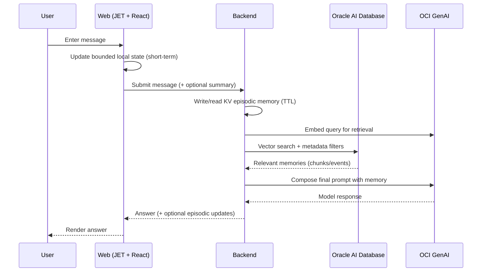

# Agent Memory on Oracle AI Database: From KV Sessions to Vector Recall

## Problem
LLM agents feel magical for a few turns, then context falls apart. We need a path that:
- Preserves useful state across turns and devices (without sending full transcripts).
- Is cost-aware and secure (no secrets, privacy by design).
- Scales to governed, durable memory using Oracle AI Database.
- Fits this repository with minimal-diff changes: UI, backend, K8s, Terraform.

This deep-dive uses exact branding — “Oracle AI Database” — and real code from this repo to implement short-term, session, and long-term memory.

## Architecture


Key memory tiers
- Short-term: local UI state (bounded turn window).
- Session/Episodic: KV store per conversation with TTL (tool outputs, preferences, summaries).
- Long-term: vectorized knowledge in Oracle AI Database with relational metadata.

## Key Code (5–10 snippets grounded in this repo)

1) Client KV wrappers (episodic/session memory)
```ts
// app/src/libs/memory.ts
// KV API wrappers for conversation state
export interface KvValue { [key: string]: any }

const API_BASE = '/api/memory'; // If a different base/proxy is used, adjust here.

export async function setKv(
  conversationId: string,
  key: string,
  value: KvValue,
  ttlSeconds?: number
): Promise<void> {
  const url = `${API_BASE}/kv/${encodeURIComponent(conversationId)}/${encodeURIComponent(key)}${
    ttlSeconds ? `?ttlSeconds=${ttlSeconds}` : ''
  }`;
  const response = await fetch(url, {
    method: 'POST',
    headers: { 'Content-Type': 'application/json' },
    body: JSON.stringify(value),
  });
  if (!response.ok) {
    throw new Error(`Failed to set KV (${response.status}): ${await safeText(response)}`);
  }
}

export async function getKv(
  conversationId: string,
  key: string
): Promise<KvValue | null> {
  const url = `${API_BASE}/kv/${encodeURIComponent(conversationId)}/${encodeURIComponent(key)}`;
  const response = await fetch(url);
  if (!response.ok) {
    return null; // 404 or other errors treated as missing
  }
  try {
    return await response.json();
  } catch {
    return null;
  }
}

export async function deleteKv(conversationId: string, key: string): Promise<void> {
  const url = `${API_BASE}/kv/${encodeURIComponent(conversationId)}/${encodeURIComponent(key)}`;
  const response = await fetch(url, { method: 'DELETE' });
  if (!response.ok) {
    throw new Error(`Failed to delete KV (${response.status}): ${await safeText(response)}`);
  }
}

async function safeText(resp: Response): Promise<string> {
  try { return await resp.text(); } catch { return ''; }
}
```

2) Backend KV endpoints (store, read, delete with optional TTL)
```java
// backend/src/main/java/.../MemoryController.java
@PostMapping(value = "/api/memory/kv/{conversationId}/{key}", consumes = MediaType.APPLICATION_JSON_VALUE)
public ResponseEntity<Void> upsertKv(@PathVariable("conversationId") String conversationId,
                                     @PathVariable("key") String key,
                                     @RequestParam(value = "ttlSeconds", required = false) Long ttlSeconds,
                                     @RequestBody String valueJson) {
  // Ensure conversation exists (idempotent) then store KV with optional TTL
  memoryService.setKv(conversationId, key, valueJson, ttlSeconds);
  return ResponseEntity.noContent().build();
}

@GetMapping(value = "/api/memory/kv/{conversationId}/{key}", produces = MediaType.APPLICATION_JSON_VALUE)
public ResponseEntity<String> getKv(@PathVariable("conversationId") String conversationId,
                                    @PathVariable("key") String key) {
  return memoryService.getKv(conversationId, key)
      .map(v -> ResponseEntity.ok().contentType(MediaType.APPLICATION_JSON).body(v))
      .orElseGet(() -> ResponseEntity.notFound().build());
}

@DeleteMapping("/api/memory/kv/{conversationId}/{key}")
public ResponseEntity<Void> deleteKv(@PathVariable("conversationId") String conversationId,
                                     @PathVariable("key") String key) {
  memoryService.deleteKv(conversationId, key);
  return ResponseEntity.noContent().build();
}
```

3) Read-only rolling summary (preview of long-memory)
```java
// backend/src/main/java/.../MemoryController.java
@GetMapping(value = "/api/memory/long/{conversationId}", produces = MediaType.TEXT_PLAIN_VALUE)
public ResponseEntity<String> getRollingSummary(@PathVariable("conversationId") String conversationId) {
  var ml = memoryLongRepository.findById(conversationId);
  if (ml.isPresent() && ml.get().getSummaryText() != null) {
    return ResponseEntity.ok(ml.get().getSummaryText());
  }
  return ResponseEntity.notFound().build();
}
```

4) Frontend usage pattern (bounded UI history + selective KV writes)
```tsx
// app/src/components/content/chat.tsx (pattern)
// Keep the list reactive and scrolled; maintain bounded local "turns" for UX.
// Combine with selective KV writes (e.g., tool outputs, user prefs) for session memory.
//
// Example pattern:
// const next = addTurn(history, { role: "user", content: text });
// await setKv(conversationId, "lastIntent", { intent: "refund" }, 3600); // TTL: 1h
// const prefs = await getKv(conversationId, "prefs");
```

5) Oracle AI Database schema for long-term memory (illustrative)
```sql
-- Dimension depends on your embed model (e.g., 1024 for cohere.embed-english-v3.0)
CREATE TABLE doc_chunks (
  id           NUMBER GENERATED BY DEFAULT AS IDENTITY PRIMARY KEY,
  tenant_id    VARCHAR2(64),
  doc_type     VARCHAR2(32),
  content      CLOB,
  embedding    VECTOR(1024, FLOAT32)
);

CREATE VECTOR INDEX doc_chunks_embedding_idx
ON doc_chunks (embedding)
ORGANIZATION NEIGHBOR PARTITIONS
WITH DISTANCE METRIC COSINE;
```

6) Retrieval query with metadata filtering
```sql
SELECT id, content
FROM doc_chunks
WHERE tenant_id = :tenant
ORDER BY embedding <-> :query_embedding
FETCH FIRST 8 ROWS ONLY;
```

7) Select AI over retrieved context (optional reasoning)
```sql
-- Use Select AI to reason over the retrieved snippets (illustrative)
SELECT AI PROMPT 'Summarize the following context for the user:' USING CLOB_AGG(content)
FROM (
  SELECT content
  FROM doc_chunks
  WHERE tenant_id = :tenant
  ORDER BY embedding <-> :query_embedding
  FETCH FIRST 8 ROWS ONLY
);
```

8) cURL tests for KV (developer sanity)
```bash
# Upsert episodic memory (1 day TTL)
curl -s -X POST \
  -H 'Content-Type: application/json' \
  'http://localhost:8080/api/memory/kv/conv-123/prefs?ttlSeconds=86400' \
  -d '{"theme":"light","tz":"UTC"}' -i

# Read it
curl -s 'http://localhost:8080/api/memory/kv/conv-123/prefs' | jq

# Delete it
curl -s -X DELETE 'http://localhost:8080/api/memory/kv/conv-123/prefs' -i
```

## Gotchas
- Token growth: never rely on unbounded transcripts. Summarize or decay windows; cap top‑k retrieval.
- TTL semantics: ensure server-side TTL enforcement in the memory service; design “Clear memory” UX for users.
- Multi-tenancy: always apply tenant_id filters in retrieval; avoid cross-tenant joins.
- Re-embedding: plan re-embeds when the embedding model changes materially; track embedding version.
- Privacy: scrub PII in memory writes; avoid logging sensitive content.

## Best Practices
- Layered memory: short-term (UI), session (KV with TTL), long-term (Oracle AI Database vectors).
- Cost control: keep MAX_TURNS small; summarize long conversations; right-size chunking and top‑k.
- Observability: log prompt size, retrieval hit count, and latency; correlate with request IDs.
- Governance: retention policies per key/memory class; user consent for durable writes; audit where needed.
- Minimal-diff: extend via additive endpoints and overlays; avoid sweeping refactors.

## Resources
- Project overview: [README.md](../../README.md)
- Retrieval patterns: [RAG.md](../../RAG.md)
- Models: [MODELS.md](../../MODELS.md)
- Services & endpoints: [SERVICES_GUIDE.md](../../SERVICES_GUIDE.md)
- Local & troubleshooting: [LOCAL.md](../../LOCAL.md), [TROUBLESHOOTING.md](../../TROUBLESHOOTING.md)
- Authoring workflow & branding guardrails:
  - [.clinerules/workflows/devrel-content.md](../../.clinerules/workflows/devrel-content.md)
  - [.clinerules/branding-oracle-ai-database.md](../../.clinerules/branding-oracle-ai-database.md)
  - [.clinerules/secrets-and-credentials-handling.md](../../.clinerules/secrets-and-credentials-handling.md)

---
Branding: Use “Oracle AI Database”. Version details are secondary and should be phrased as “Oracle AI Database (version details for compatibility only)”.
