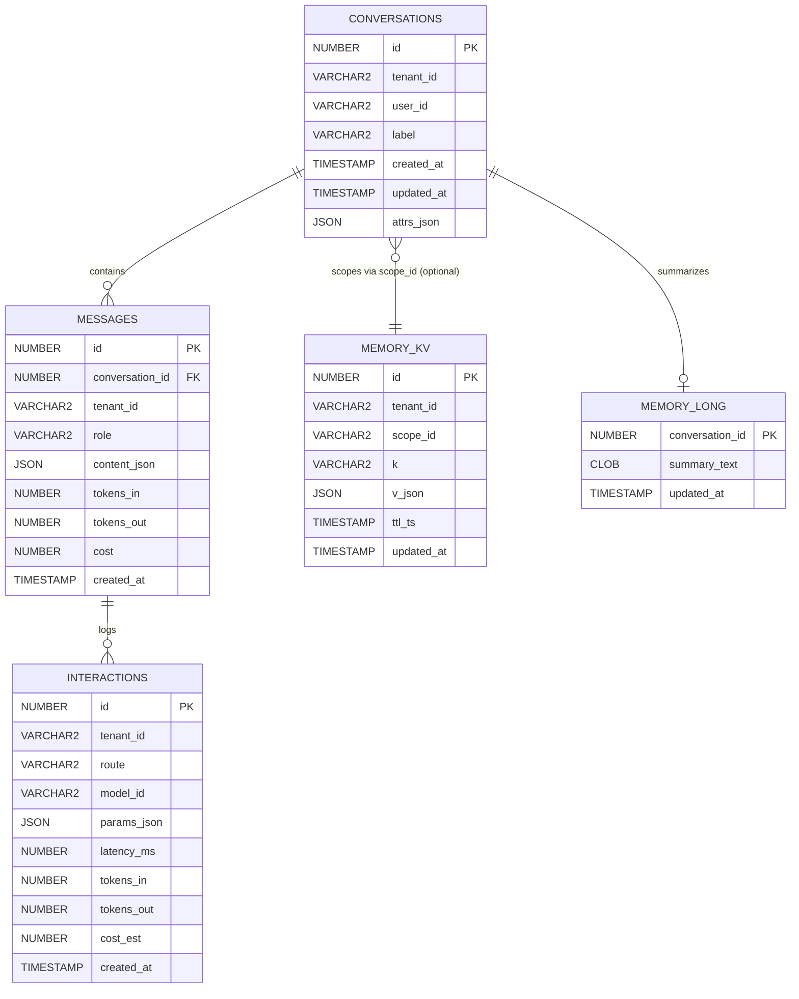

# Agent Memory on Oracle AI Database

This document describes how this project implements production‑grade agent memory on Oracle AI Database. It focuses on conversation history, key‑value (KV) memory for agent state, and optional summaries/telemetry – the data the agent uses to recall context across turns. The Retrieval‑Augmented Generation (RAG) Knowledge Base (documents, chunks, embeddings) is covered separately in RAG.md.

This guide covers:
- Schema design for agent memory (conversations, messages, memory_kv, optional memory_long and interactions)
- Copy/paste‑ready DDL and indexes optimized for common memory patterns
- Liquibase migration outline to adopt or evolve this schema safely


Cross-references: See SERVICES_GUIDE.md for backend integration, RAG.md for KB tables.

## Schema Diagram (Mermaid)



---

## 1) What is “agent memory” in this app?

Agent memory stores context the assistant uses between turns:
- Conversation memory (short‑term): ordered turns (system, user, assistant) for a session.
- KV/context memory (state): small, structured facts such as user preferences, tool state, scratchpads.
- Summaries (optional): compressed conversation snapshots for long‑running threads.
- Telemetry (optional): interaction analytics (latency, token counts, estimated cost).

RAG Knowledge Base is separate long‑term knowledge (documents and embeddings). It complements agent memory but is out of scope for this document (see RAG.md).

---

## 2) Recommended schema (DDL)

These tables are designed for:
- Append‑only messages with bounded retrieval windows (last N or by timebox)
- Fast per‑conversation reads, multi‑tenant isolation
- JSON content for flexible message shape
- Straightforward KV upserts for tool state

If you already deployed V1__core_tables.sql, see the migration outline below to evolve gradually.

### 2.1 conversations

A session container for messages and optional summary.

```sql
CREATE TABLE conversations (
  id          NUMBER GENERATED BY DEFAULT AS IDENTITY PRIMARY KEY,
  tenant_id   VARCHAR2(64)  NOT NULL,
  user_id     VARCHAR2(128),
  label       VARCHAR2(256),
  created_at  TIMESTAMP      DEFAULT SYSTIMESTAMP NOT NULL,
  updated_at  TIMESTAMP,
  attrs_json  JSON
);

-- Query recent sessions by tenant
CREATE INDEX conv_tenant_created_ix ON conversations (tenant_id, created_at DESC);
```

### 2.2 messages

Append‑only rows per conversation turn. Content uses JSON to support structured/multi‑part messages.

```sql
CREATE TABLE messages (
  id               NUMBER GENERATED BY DEFAULT AS IDENTITY PRIMARY KEY,
  conversation_id  NUMBER NOT NULL
                   REFERENCES conversations(id),
  tenant_id        VARCHAR2(64) NOT NULL,
  role             VARCHAR2(16) NOT NULL
                   CHECK (role IN ('system','user','assistant')),
  content_json     JSON NOT NULL,         -- e.g., {"text":"...", "parts":[...] }
  tokens_in        NUMBER,                -- optional telemetry
  tokens_out       NUMBER,                -- optional telemetry
  cost             NUMBER,                -- optional estimated cost
  created_at       TIMESTAMP DEFAULT SYSTIMESTAMP NOT NULL
);

-- Typical read paths: recent messages by conversation, or scanning by tenant
CREATE INDEX msg_conv_created_ix   ON messages (conversation_id, created_at);
CREATE INDEX msg_tenant_created_ix ON messages (tenant_id, created_at DESC);
```

Tip: When feeding the model, fetch a window of recent messages in descending created_at, then order ascending client‑side (or via a subquery) so prompts maintain natural chronological order.

### 2.3 memory_kv

Key‑value store for agent context and preferences. Scope is flexible: per user, per conversation, or global by tenant.

```sql
CREATE TABLE memory_kv (
  id          NUMBER GENERATED BY DEFAULT AS IDENTITY PRIMARY KEY,
  tenant_id   VARCHAR2(64) NOT NULL,
  scope_id    VARCHAR2(128),      -- e.g., userId or conversationId
  k           VARCHAR2(128) NOT NULL,
  v_json      JSON,
  ttl_ts      TIMESTAMP,          -- optional time‑to‑live
  updated_at  TIMESTAMP DEFAULT SYSTIMESTAMP NOT NULL,
  CONSTRAINT uq_memory_kv UNIQUE (tenant_id, scope_id, k)
);

CREATE INDEX kv_tenant_scope_ix ON memory_kv (tenant_id, scope_id);
```

### 2.4 memory_long (optional)

Conversation summaries or distilled state. Keep small; regenerate as needed.

```sql
CREATE TABLE memory_long (
  conversation_id  NUMBER PRIMARY KEY
                   REFERENCES conversations(id),
  summary_text     CLOB,
  updated_at       TIMESTAMP DEFAULT SYSTIMESTAMP NOT NULL
);
```

### 2.5 interactions (optional telemetry)

If you track route, model, latency, and tokens for analytics and SLOs.

```sql
CREATE TABLE interactions (
  id          NUMBER GENERATED BY DEFAULT AS IDENTITY PRIMARY KEY,
  tenant_id   VARCHAR2(64) NOT NULL,
  route       VARCHAR2(128),
  model_id    VARCHAR2(255),
  params_json JSON,
  latency_ms  NUMBER,
  tokens_in   NUMBER,
  tokens_out  NUMBER,
  cost_est    NUMBER,
  created_at  TIMESTAMP DEFAULT SYSTIMESTAMP NOT NULL
);

CREATE INDEX idx_interactions_tenant_time
  ON interactions (tenant_id, created_at DESC);
```

---

## 3) Safe SQL patterns (bind variables)

The following patterns adhere to best practices for Oracle AI Database and prevent plan instability or injection risks.

### 3.1 Append a message

```sql
-- :conversation_id, :tenant_id, :role, :content_json, :tokens_in, :tokens_out, :cost
INSERT INTO messages (
  conversation_id, tenant_id, role, content_json,
  tokens_in, tokens_out, cost
) VALUES (
  :conversation_id, :tenant_id, :role, :content_json,
  :tokens_in, :tokens_out, :cost
);
```

content_json example payload:
```json
{"text":"Hello","attachments":[]}
```

### 3.2 Retrieve last K messages (chronological)

```sql
-- Returns oldest→newest within the K‑message window
SELECT role, content_json, created_at
FROM (
  SELECT role, content_json, created_at
  FROM messages
  WHERE conversation_id = :conversation_id
  ORDER BY created_at DESC
  FETCH FIRST :k ROWS ONLY
)
ORDER BY created_at ASC;
```

### 3.3 Time‑boxed retrieval (e.g., last 15 minutes)

```sql
SELECT role, content_json
FROM messages
WHERE conversation_id = :conversation_id
  AND created_at >= SYSTIMESTAMP - INTERVAL '15' MINUTE
ORDER BY created_at ASC;
```

### 3.4 KV upsert (MERGE)

```sql
-- :tenant_id, :scope_id, :k, :v_json
MERGE INTO memory_kv t
USING (SELECT :tenant_id AS tenant_id, :scope_id AS scope_id, :k AS k FROM dual) s
   ON (t.tenant_id = s.tenant_id AND t.scope_id = s.scope_id AND t.k = s.k)
WHEN MATCHED THEN
  UPDATE SET t.v_json = :v_json, t.updated_at = SYSTIMESTAMP
WHEN NOT MATCHED THEN
  INSERT (tenant_id, scope_id, k, v_json)
  VALUES (:tenant_id, :scope_id, :k, :v_json);
```

### 3.5 KV fetch (with optional TTL)

```sql
SELECT v_json
FROM memory_kv
WHERE tenant_id = :tenant_id
  AND scope_id  = :scope_id
  AND k         = :k
  AND (ttl_ts IS NULL OR ttl_ts >= SYSTIMESTAMP);
```

### 3.6 Retention / cleanup (batched)

```sql
-- Example: purge messages older than 30 days in small batches
DELETE FROM messages
WHERE created_at < SYSTIMESTAMP - INTERVAL '30' DAY
  AND ROWNUM <= :batch_size;
```

---

## 4) Liquibase migration outline

This repository uses formatted SQL migrations and a master changelog (see:
- backend/src/main/resources/db/changelog/db.changelog-master.yaml
- backend/src/main/resources/db/migration/V1__core_tables.sql
- backend/src/main/resources/db/migration/V2__kb_tables.sql

For adopting or evolving the agent memory schema, add a new formatted SQL (e.g., `V3__agent_memory.sql`). Keep changes additive where possible and handle PL/SQL blocks with `endDelimiter:/`.

### 4.1 Create new objects (fresh start)

```sql
-- changeset app:20251104-001 create conversations/messages/memory_kv
CREATE TABLE conversations (...);  -- use DDL from section 2.1
CREATE INDEX conv_tenant_created_ix ON conversations (tenant_id, created_at DESC);

CREATE TABLE messages (...);       -- use DDL from section 2.2
CREATE INDEX msg_conv_created_ix   ON messages (conversation_id, created_at);
CREATE INDEX msg_tenant_created_ix ON messages (tenant_id, created_at DESC);

CREATE TABLE memory_kv (...);      -- use DDL from section 2.3
CREATE INDEX kv_tenant_scope_ix ON memory_kv (tenant_id, scope_id);

-- rollback (example minimal)
-- rollback DROP TABLE memory_kv;
-- rollback DROP TABLE messages;
-- rollback DROP TABLE conversations;
```

### 4.2 Evolve existing V1 schema (incremental)

If you already have V1 tables (e.g., `messages.content` as VARCHAR2/CLOB), migrate towards JSON and better keys incrementally:

```sql
-- changeset app:20251104-010 add content_json to messages
ALTER TABLE messages ADD (content_json JSON);

-- changeset app:20251104-011 backfill JSON from legacy content (idempotent example)
-- endDelimiter:/ splitStatements:false
DECLARE
  CURSOR c IS
    SELECT id, content_json, /* legacy */ TO_CLOB(NULL) AS legacy_content
    FROM messages
    WHERE content_json IS NULL;
BEGIN
  FOR r IN c LOOP
    -- If you stored legacy content in a text column, map to {"text": "..."} here.
    -- UPDATE messages SET content_json = JSON_OBJECT('text' VALUE r.legacy_content)
    -- WHERE id = r.id;
    NULL; -- placeholder, adjust to your legacy column
  END LOOP;
END;
/

-- changeset app:20251104-012 add indexes (if missing)
CREATE INDEX msg_conv_created_ix   ON messages (conversation_id, created_at);
CREATE INDEX msg_tenant_created_ix ON messages (tenant_id, created_at DESC);

/* Optional: drop legacy text column after validation
-- changeset app:20251104-013 drop legacy content column
ALTER TABLE messages DROP COLUMN content;
-- rollback ALTER TABLE messages ADD (content CLOB);
*/

-- changeset app:20251104-020 strengthen KV with unique key and scope
ALTER TABLE memory_kv ADD (scope_id VARCHAR2(128));
ALTER TABLE memory_kv ADD (ttl_ts TIMESTAMP);
-- Create unique key if not present
ALTER TABLE memory_kv ADD CONSTRAINT uq_memory_kv UNIQUE (tenant_id, scope_id, k);
CREATE INDEX kv_tenant_scope_ix ON memory_kv (tenant_id, scope_id);
```

Guidelines:
- Use additive changes (ADD COLUMN/INDEX) first.
- Backfill JSON from legacy text cautiously; wrap in a PL/SQL block with `endDelimiter:/` to keep parsing correct.
- Drop old columns only after data validation and application updates.
- Keep rollbacks simple (or document forward‑fix procedures if non‑trivial).

---

## 5) Backend integration notes

Code references in this repository:
- Memory service classes (example): `backend/src/main/java/.../service/MemoryService.java`
- Repositories (example): `backend/src/main/java/.../repository/MemoryKvRepository.java`
- Conversation flows reference `conversations` and `messages` to build prompt windows.

Integration tips:
- Use bind variables in all SQL.
- For message windows, prefer a bounded K and/or timebox to keep prompts small and fast.
- Keep transactions short; avoid chatty PL/SQL in a single transaction.
- Include telemetry (tokens_in, tokens_out, cost) when available; if not, store NULLs.

Observability:
```sql
BEGIN
  DBMS_APPLICATION_INFO.SET_MODULE('genai-backend', 'conversation-memory');
  DBMS_APPLICATION_INFO.SET_CLIENT_INFO('tenant=default'); -- or request id
END;
/
```

---

## 6) Security, governance, and operations

- Least privilege: use roles and limit direct grants to application users.
- Secrets: do not store credentials in tables; rely on ADB wallets and secure configuration.
- PII: if storing personal data in content_json, consider masking strategies and access controls.
- Retention: Define policies (e.g., purge messages older than N days) and schedule jobs.
- Auditing: enable DB‑level auditing for sensitive operations where required.

---

## 7) Validation queries

Quick checks after deployment:

```sql
-- Sessions exist?
SELECT COUNT(*) FROM conversations;

-- Messages for a session (expect recent first)
SELECT role, created_at FROM messages
WHERE conversation_id = :conversation_id
ORDER BY created_at DESC
FETCH FIRST 5 ROWS ONLY;

-- KV entries for a user or conversation
SELECT k, v_json, updated_at
FROM memory_kv
WHERE tenant_id = :tenant_id AND scope_id = :scope_id;
```

---

## 8) Notes on ADB connectivity and Liquibase

- JDBC + wallet: see TROUBLESHOOTING.md for configuration and OKE wallet mounting.
- Liquibase: when combining PL/SQL with DDL, ensure the PL/SQL block ends with a slash on a new line and set `endDelimiter:/` and/or `splitStatements:false` as needed. This repository’s migrations follow those patterns.

---

## 9) Relationship to RAG

- Agent memory (this document) stores chat turns, summaries, and small structured state.
- RAG Knowledge Base (RAG.md) stores long‑term documents and embeddings.
- A typical prompt composes:
  - A bounded window of recent `messages`
  - Optional `memory_long` summary
  - Optionally KV state from `memory_kv`
  - Retrieved context from RAG

Keep each layer focused and independently operable.

---

## Appendix: minimal Liquibase changeSet example (SQL format)

```sql
-- changeset app:20251104-100 create conversations/messages
CREATE TABLE conversations (
  id          NUMBER GENERATED BY DEFAULT AS IDENTITY PRIMARY KEY,
  tenant_id   VARCHAR2(64)  NOT NULL,
  user_id     VARCHAR2(128),
  label       VARCHAR2(256),
  created_at  TIMESTAMP      DEFAULT SYSTIMESTAMP NOT NULL,
  updated_at  TIMESTAMP,
  attrs_json  JSON
);
CREATE INDEX conv_tenant_created_ix ON conversations (tenant_id, created_at DESC);

CREATE TABLE messages (
  id               NUMBER GENERATED BY DEFAULT AS IDENTITY PRIMARY KEY,
  conversation_id  NUMBER NOT NULL REFERENCES conversations(id),
  tenant_id        VARCHAR2(64) NOT NULL,
  role             VARCHAR2(16) NOT NULL CHECK (role IN ('system','user','assistant')),
  content_json     JSON NOT NULL,
  tokens_in        NUMBER,
  tokens_out       NUMBER,
  cost             NUMBER,
  created_at       TIMESTAMP DEFAULT SYSTIMESTAMP NOT NULL
);
CREATE INDEX msg_conv_created_ix   ON messages (conversation_id, created_at);
CREATE INDEX msg_tenant_created_ix ON messages (tenant_id, created_at DESC);

-- rollback DROP TABLE messages;
-- rollback DROP TABLE conversations;
```

This schema and the associated patterns enable reliable, observable, and scalable agent memory on Oracle AI Database with clear migration paths and minimal operational risk.

## Q&A
Q: How do I add a new table? A: Create a new Liquibase changeset in backend/src/main/resources/db/migration/Vn__new_table.sql, using additive DDL and rollback statements.
Q: What if VECTOR type is not supported? A: Use fallback types; see RAG.md for embedding alternatives.
